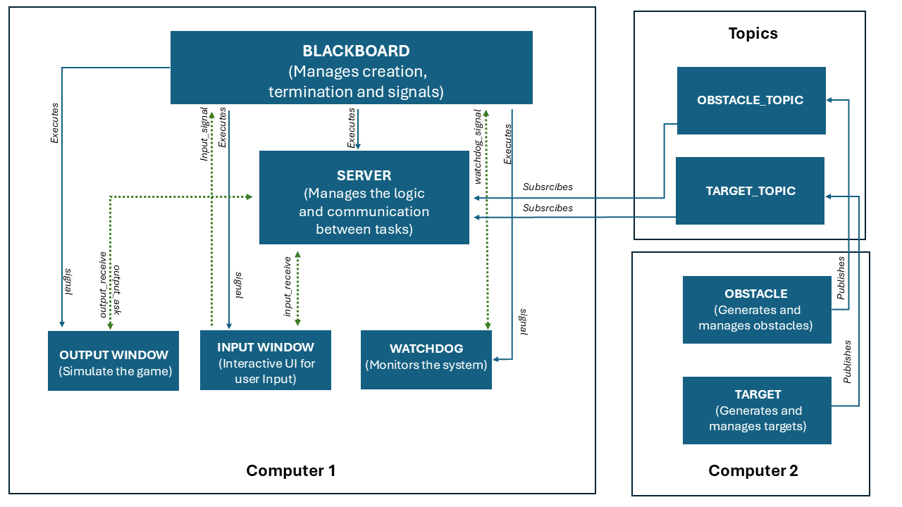

# Drone Simulator (DDS-Based)

## Table of Contents
- [Introduction](#introduction)
- [Architecture](#architecture)
- [Components](#components)
- [Project Structure](#project-structure)
- [Installation](#installation)
- [Usage](#usage)
- [Configuration](#configuration)
- [Logging](#logging)
- [Error Handling](#error-handling)
- [Signal Handling](#signal-handling)
- [Debugging](#debugging)
- [Repository](#repository)

## Introduction
The `drone_simulator` project is a distributed simulation of a drone environment involving multiple processes. It demonstrates inter-process communication (IPC) using **DDS (Data Distribution Service)**, signal handling, error management, and logging in a multi-process system split across two computers.

## Architecture


The architecture consists of:
- **Computer 1:** Runs the Blackboard, Server, Input Window, and Output Window processes.
- **Computer 2:** Runs the Obstacle and Target processes.
- **DDS Communication:** Used between the Server and the Obstacle/Target processes.

### Processes Overview

#### **Computer 1 (Main Application)**
- **Blackboard Process**: Master process managing execution and signals.
- **Server Process**: Handles main game logic and state updates.
- **Input Window Process**: Captures user input and sends commands to the server.
- **Output Window Process**: Displays the drone simulation state.

#### **Computer 2 (Target & Obstacle Generator)**
- **Obstacle Process**: Generates and manages obstacles.
- **Target Process**: Generates and manages targets.

### Communication Model
- **DDS (Data Distribution Service)** is used for communication between the Server (subscriber) and the Obstacle/Target processes (publishers).
- **Signals (SIGCONT, SIGSTOP, SIGTERM)** are still used for local process management on main application computer.

## Components
### Blackboard Process
- **File**: `src/blackboard_process.c`
- **Description**: Manages process creation, termination, and signal handling.

### Server Process
- **File**: `src/server_process.c`
- **Description**: Core logic manager, now subscribing to DDS topics from the Obstacle and Target processes.

### Input Window Process
- **File**: `src/input_window_process.c`
- **Description**: Captures user input and sends commands to the server.

### Output Window Process
- **File**: `src/output_window_process.c`
- **Description**: Displays the game state based on server updates.

### Obstacle Process (DDS Publisher)
- **File**: `src/obstacle_process.cpp`
- **Description**: Publishes obstacle data to the DDS topic.

### Target Process (DDS Publisher)
- **File**: `src/target_process.cpp`
- **Description**: Publishes target data to the DDS topic.

## Project Structure
```
drone_simulator/
├── src/
│   ├── blackboard_process.c
│   ├── server_process.c
│   ├── input_window_process.c
│   ├── output_window_process.c
│   ├── obstacle_process.cpp
│   ├── target_process.cpp
├── config/
│   └── config.yaml
├── CMakeLists.txt
├── build/
│   ├── log/
│   └── run.sh
└── graphs/
    ├── architecture_dds.PNG
    ├── Inputwindow.png
    └── Outputwindow.png
```

## Installation
1. **Clone the Repository**:
    ```sh
    git clone https://github.com/MazenAtta/drone_simulator.git
    cd drone_simulator
    ```

2. **Build the Project**:
    ```sh
    mkdir build && cd build
    cmake ..
    make
    ```

## Usage
1. **Run the Main Application (Computer 1)**:
    ```sh
    ./run.sh
    1
    ```

2. **Run the Target & Obstacle Generator (Computer 2)**:
    ```sh
    ./run.sh
    2
    ```

## Configuration
Modify settings in `config/config.yaml`. Defaults are used if missing.

## Logging
Log files are stored in the `log` directory for debugging and error tracking.

## Error Handling
Errors are managed with `perror()` and custom handling functions. Logs capture critical failures.

## Signal Handling
Handled signals:
- `SIGCONT`: Resume paused processes.
- `SIGSTOP`: Pause processes.
- `SIGTERM`: Terminate processes.

## Debugging
Use log files in the `log` directory for diagnostics.

## Repository
For more details, visit the [drone_simulator GitHub repository](https://github.com/MazenAtta/drone_simulator).

