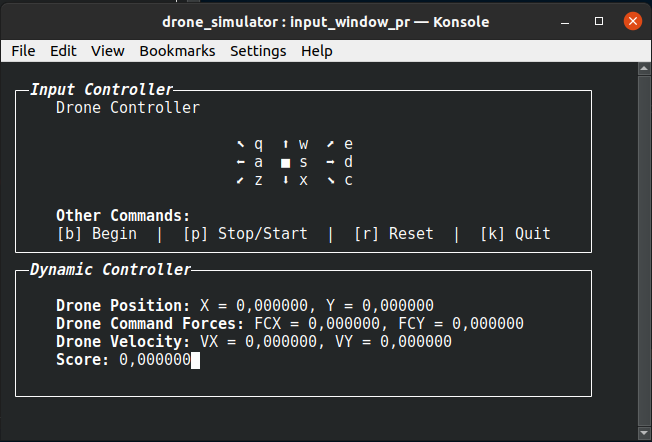
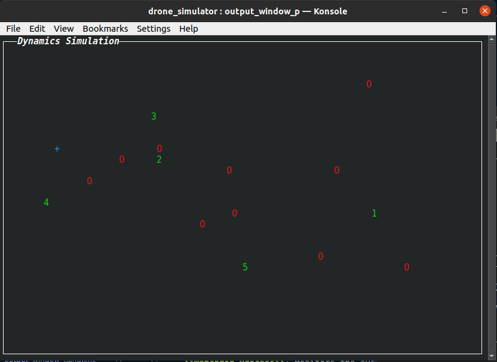

# Drone Simulator

## Table of Contents
- [Introduction](#introduction)
- [Installation](#installation)
- [Configuration](#configuration)
- [Usage](#usage)
- [How To Play](#how-to-play)
- [Architecture](#architecture)
- [Project Structure](#project-structure)
- [Components](#components)
- [Logging](#logging)
- [Error Handling](#error-handling)
- [Signal Handling](#signal-handling)
- [Debugging](#debugging)
- [Repository](#repository)

## Introduction
The `drone_simulator` project is a simple simulation of a drone environment involving multiple processes that communicate through named pipes. The project aims to demonstrate the usage of inter-process communication (IPC) techniques, signal handling, error management, and logging in a multi-process system.

## Installation
1. **Clone the Repository**:
   ```sh
   git clone https://github.com/MazenAtta/drone_simulator.git
   cd drone_simulator
   ```

2. **Build the Project**:
   ```sh
   make
   ```

## Configuration
Configuration settings for the game are managed through the `config/config.yaml` file. Ensure you have this file set up correctly before running the simulation if not the game will use the default values.

## Usage
1. **Run the Blackboard Process**:
   ```sh
   ./blackboard_process
   ```

2. **Interact with the Simulation**:
   - Use the input window to send commands to the drone.
   - Observe the output window for the current state of the game.

## How To Play
Once the game starts, you will be in a waiting state where the targets and obstacles change randomly every 10 seconds until the user begins the game by pressing the 'b' button. Once pressed, the game starts, and you can control the drone using:
- `q`, `w`, `e`, `a`, `s`, `d`, `z`, `x`, `c` for controlling the drone.
- `b` to begin the game.
- `p` to pause or continue all processes.
- `r` to reset all processes.
- `k` to terminate all processes.

Commands are stackable and continuous up to 5. Targets must be taken in order for a +10 score, while hitting obstacles incurs a -0.1 penalty per hit. Changing drone parameters (e.g., weight, viscosity) can be done live in `config/config.yaml`.

## Architecture


The architecture consists of the following processes:
- **Blackboard Process**: Acts as the master process, managing the execution and signals.
- **Server Process**: Handles the communication between processes main game logic and state updates.
- **Input Window Process**: An interactive UI windows that captures user input, sends commands to the server and displays the drone state.
- **Output Window Process**: Simulate the game and the drone and environment dynamics.
- **Obstacle Process**: Generates and manages obstacles in the game.
- **Target Process**: Generates and manages targets in the game.
- **Watchdog Process**: Monitors the system and ensures all processes are running as expected.

## Project Structure
```
   drone_simulator/
   ├── src/
   │   ├── blackboard_process.c
   │   ├── server_process.c
   │   ├── input_window_process.c
   │   ├── output_window_process.c
   │   ├── obstacle_process.c
   │   ├── target_process.c
   │   └── watchdog_process.c
   ├── config/
   │   └── config.yaml
   ├── log/
   ├── Makefile
   ├── README.md
   └── graphs/
      ├── architecture.PNG
      ├── Inputwindow.png
      └── Outputwindow.png
```

## Components
### Blackboard Process
- **File**: `src/blackboard_process.c`
- **Description**: Manages the creation and termination of all other processes. Handles signals for pausing, resetting, and terminating the simulation.

### Server Process
- **File**: `src/server_process.c`
- **Description**: Manages the game state, including the positions of the drone, obstacles, and targets. Reads from and writes to named pipes to communicate with other processes.

### Input Window Process
- **File**: `src/input_window_process.c`
- **Description**: Captures user input and sends commands to the server process.

#### Screenshot and Explanation


The input window shows the following controls:
- **Controls**: 
  - `q`, `w`, `e`, `a`, `s`, `d`, `z`, `x`, `c` for controlling the drone.
  - `b` to begin the game.
  - `p` to pause or continue all processes.
  - `r` to reset all processes.
  - `k` to terminate all processes.
- **Drone State**:
  - Position in `x` and `y`.
  - Velocity in `x` and `y`.
  - Cumulative command force in `x` and `y`.
  - Score.

### Output Window Process
- **File**: `src/output_window_process.c`
- **Description**: Displays the current state of the game, including the positions of the drone, obstacles, and targets.

#### Screenshot and Explanation


The output window shows:
- The drone as a blue `+`.
- Obstacles as red `O`.
- Targets as green numbers from 1 to 5.

### Obstacle Process
- **File**: `src/obstacle_process.c`
- **Description**: Generates and manages obstacles in the game.

### Target Process
- **File**: `src/target_process.c`
- **Description**: Generates and manages targets in the game.

### Watchdog Process
- **File**: `src/watchdog_process.c`
- **Description**: Monitors the system's health and ensures all processes are running as expected.

## Logging
Log files for each process are created in the `log` directory. These files provide detailed information about the execution and state of each process.

## Error Handling
Error handling is implemented using `perror()` and custom error management functions. Critical errors are logged, and processes are terminated gracefully if necessary.

## Signal Handling
The following signals are handled:
- **SIGCONT**: Used to pause and resume processes.
- **SIGSTOP**: Used to stop processes.
- **SIGTERM**: Used to terminate processes.

## Debugging
Debug messages and log entries are used to track the execution and state of the system. Use the log files in the `log` directory to diagnose issues.

## Repository
For more information, visit the [drone_simulator GitHub repository](https://github.com/MazenAtta/drone_simulator).
