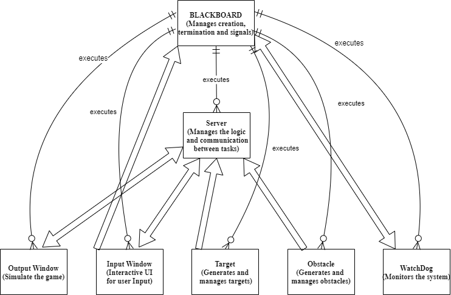

# Drone Simulator

## Table of Contents
- [Introduction](#introduction)
- [Architecture](#architecture)
- [Components](#components)
- [Installation](#installation)
- [Usage](#usage)
- [Configuration](#configuration)
- [Logging](#logging)
- [Error Handling](#error-handling)
- [Signal Handling](#signal-handling)
- [Debugging](#debugging)

## Introduction
The `drone_simulator` project is a simple simulation of a drone environment involving multiple processes that communicate through named pipes. The project aims to demonstrate the usage of inter-process communication (IPC) techniques, signal handling, error management, and logging in a multi-process system.

### Demo Video
![Drone Simulator Demo]

## Architecture


The architecture consists of the following processes:
- **Blackboard Process**: Acts as the master process, managing the execution and signals.
- **Server Process**: Handles the communication between processes main game logic and state updates.
- **Input Window Process**: An interactive UI windows that captures user input, sends commands to the server and displays the drone state.
- **Output Window Process**: Simulate the game and the drone and environment dynamics.
- **Obstacle Process**: Generates and manages obstacles in the game.
- **Target Process**: Generates and manages targets in the game.
- **Watchdog Process**: Monitors the system and ensures all processes are running as expected.

### Detailed Architecture Description

The architecture of the `drone_simulator` is designed to manage the interactions between multiple processes using named pipes for inter-process communication. Below is a detailed description of each component and their interactions:

1. **Blackboard Process**
   - **Role**: Central coordinator of the system.
   - **Function**: Manages the creation, termination, and signalling of all other processes. It listens for control signals (pause, reset, terminate) and acts accordingly.
   - **Communication**: Sends and receives signals to/from all other processes.

2. **Server Process**
   - **Role**: Core game logic manager.
   - **Function**: Manages the game state, including the positions of the drone, obstacles, and targets. It reads commands from the `input_window_process` and updates the game state accordingly.
   - **Communication**: Uses named pipes to communicate with `input_window_process`, `output_window_process`, `obstacle_process`, and `target_process`.

3. **Input Window Process**
   - **Role**: User input handler.
   - **Function**: Captures user input (e.g., commands to control the drone) and sends these commands to the `server_process`.
   - **Communication**: Writes commands to a named pipe read by the `server_process`.

4. **Output Window Process**
   - **Role**: Game state display.
   - **Function**: Renders the current game state, including drone, obstacles, and targets, based on data received from the `server_process`.
   - **Communication**: Reads game state updates from a named pipe written by the `server_process`.

5. **Obstacle Process**
   - **Role**: Obstacle manager.
   - **Function**: Generates and manages obstacles within the game environment.
   - **Communication**: Sends obstacle data to the `server_process` via a named pipe.

6. **Target Process**
   - **Role**: Target manager.
   - **Function**: Generates and manages targets within the game environment.
   - **Communication**: Sends target data to the `server_process` via a named pipe.

7. **Watchdog Process**
   - **Role**: System health monitor.
   - **Function**: Monitors the health and status of all processes, ensuring they are running as expected. If a process fails, the `watchdog_process` can trigger a system reset or take corrective action.
   - **Communication**: Communicates with the `blackboard_process` to report system status and receive control signals.

### Communication and Data Flow

1. **Named Pipes**:
   - **Description**: Named pipes are used for inter-process communication. Each process reads from and writes to specific named pipes to send and receive data.
   - **Example Pipes**:
     - `/tmp/input_ask`
     - `/tmp/input_receive`
     - `/tmp/output_ask`
     - `/tmp/output_receive`
     - `/tmp/obstacle_receive`
     - `/tmp/target_receive`
     - `/tmp/input_signal`
     - `/tmp/watchdog_signal`

2. **Signals**:
   - **Description**: Signals are used for process control. The `blackboard_process` sends signals to start, stop, and reset the simulation.
   - **Handled Signals**:
     - `SIGCONT`: Continue paused processes.
     - `SIGSTOP`: Pause processes.
     - `SIGTERM`: Terminate processes.

### Interaction Summary

- The `blackboard_process` is the central coordinator, managing all other processes.
- The `server_process` handles the core game logic and communicates with the input, output, obstacle, and target processes.
- The `input_window_process` captures user input and sends commands to the server.
- The `output_window_process` displays the game state based on updates from the server.
- The `obstacle_process` generates obstacles and sends data to the server.
- The `target_process` generates targets and sends data to the server.
- The `watchdog_process` monitors the health of all processes and communicates with the blackboard for management.

## Components
### Blackboard Process
- **File**: `src/blackboard_process.c`
- **Description**: Manages the creation and termination of all other processes. Handles signals for pausing, resetting, and terminating the simulation.

### Server Process
- **File**: `src/server_process.c`
- **Description**: Manages the game state, including the positions of the drone, obstacles, and targets. Reads from and writes to named pipes to communicate with other processes.

### Input Window Process
- **File**: `src/input_window_process.c`
- **Description**: Captures user input and sends commands to the server process.

#### Screenshot and Explanation


The input window shows the following controls:
- **Controls**: 
  - `q`, `w`, `e`, `a`, `s`, `d`, `z`, `x`, `c` for controlling the drone.
  - `b` to begin the game.
  - `p` to pause or continue all processes.
  - `r` to reset all processes.
  - `k` to terminate all processes.
- **Drone State**:
  - Position in `x` and `y`.
  - Velocity in `x` and `y`.
  - Cumulative command force in `x` and `y`.
  - Score.

### Output Window Process
- **File**: `src/output_window_process.c`
- **Description**: Displays the current state of the game, including the positions of the drone, obstacles, and targets.

#### Screenshot and Explanation


The output window shows:
- The drone as a blue `+`.
- Obstacles as red `O`.
- Targets as green numbers from 1 to 5.

### Obstacle Process
- **File**: `src/obstacle_process.c`
- **Description**: Generates and manages obstacles in the game.

### Target Process
- **File**: `src/target_process.c`
- **Description**: Generates and manages targets in the game.

### Watchdog Process
- **File**: `src/watchdog_process.c`
- **Description**: Monitors the system's health and ensures all processes are running as expected.

## Installation
1. **Clone the Repository**:
    ```sh
    git clone https://github.com/MazenAtta/drone_simulator.git
    cd drone_simulator
    ```

2. **Build the Project**:
    ```sh
    make
    ```

## Usage
1. **Run the Blackboard Process**:
    ```sh
    ./blackboard_process
    ```

2. **Interact with the Simulation**:
   - Use the input window to send commands to the drone.
   - Observe the output window for the current state of the game.

## Configuration
Configuration settings for the game are managed through the `config/config.yaml` file. Ensure you have this file set up correctly before running the simulation if not the game will use the default values.

## Logging
Log files for each process are created in the `log` directory. These files provide detailed information about the execution and state of each process.

## Error Handling
Error handling is implemented using `perror()` and custom error management functions. Critical errors are logged, and processes are terminated gracefully if necessary.

## Signal Handling
The following signals are handled:
- **SIGCONT**: Used to pause and resume processes.
- **SIGSTOP**: Used to stop processes.
- **SIGTERM**: Used to terminate processes.

## Debugging
Debug messages and log entries are used to track the execution and state of the system. Use the log files in the `log` directory to diagnose issues.